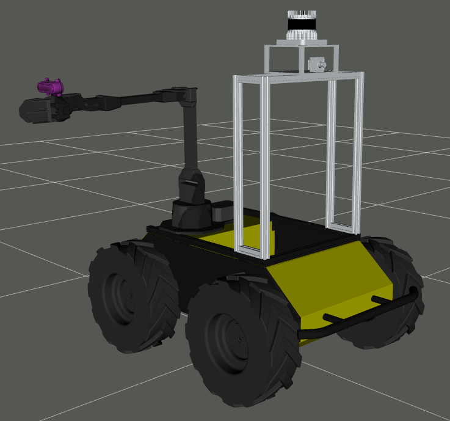

# uia_husky_vx300
This repository can be used to set up an Interbotix vx300 manipulator with moveit configuration for collision avoidance with a Clearpath Husky UGV.

## Installation
Open terminal.

Create a ws folder and move into it

~~~bash
mkdir ros2_ws
mkdir src
cd ros2_ws/src
~~~

Clone this repo

~~~bash
git clone https://github.com/orjano-max/uia_husky_vx300
~~~

Go into cloned git folder

~~~bash
cd uia_husky_vx300
~~~

Update the submodules of this repo, there are alot of them
~~~bash
git submodule update --init --recursive
~~~

Run the following commands:

~~~bash
cd interbotix_ros_core/interbotix_ros_xseries/interbotix_xs_sdk
sudo cp 99-interbotix-udev.rules /etc/udev/rules.d/
sudo udevadm control --reload-rules && sudo udevadm trigger
~~~

Go back to the ws folder

~~~bash
cd ros2_ws
~~~

Run rosdep

~~~bash
rosdep install --from-path src --ignore-src --rosdistro galactic -y
~~~

Install python-modern-robotics, somehow, this package is not a part of the interbotix rosdep

~~~bash
pip install modern-robotics
~~~

Build

~~~bash
colcon build
~~~

## Overview

### Husky Master
This package contains the top level code that sende nav2 positions to the husky and pick or place commands. This is the thing that stitches together the whole functionality of the system.
Before running this node, make sure that the ugv is able to reach the defined positions, alternatively alter the positions as they are hardcoded.
This package is more of a proof of concept on the work of the master thesis.

1. Make sure that you have a UGV with nav2 up and running.

2. Source and launch the husky_interbotix package, specifically xavier2_launch.py. This will bring up the manipulator with detection and get it ready to take commands. Or launch everything yourself, whatever you want

3. Source and run this node:

~~~bash
ros2 run husky_master husky_master
~~~

This will run the node with some default parameters

It is also possible to use the launch file. It has the ability to change some parameters, like what object to pick, where to pick it and the dimensions of the object you want to pick(only z parameter in dimensions will be used as the implementation is today.)

### Husky interbotix
This package contains launch files and parameters to bring up the complete system with the interbotix vx300 manipulator along with a realsense camera. 

Runnig the xavier2 launch file will bring up the manipulator, a realsense camera, an apriltag node for continuous tag detection as well as a ros node that listens for various pick and place commands and controls the manipulator. Run the file using this command(after building and sourcing of course):

~~~bash
ros2 launch husky_interbotix xavier2_launch.py
~~~

This package also contains a launch file that makes it possible to bring up rviz with moveit configuration for remote view. For example if the manipulator is launched on an xavier through ssh and you want to use the moveit plugin in rviz on your own computer. This launch file is called rviz_moveit.launch.py. It needs robot model as input to run. Remember to pass all relevant urdf and srdf files to the launch file if you want to use your own configurations(for example camera mount to be attatched). Run the file using this command(after building and sourcing):

~~~bash
ros2 launch husky_interbotix rviz_moveit.launch.py
~~~

There is also a sim launch file among others, but there are no garuantees that these will work.

### Husky Pick and Place
This package contains a class for pick and place operations with the interbotix vx300 manipulator through moveit.
Launching this package will start a ros node that listens for commans over the topic "vx300/action" topic and execute them.
Changing the namespace to another interbotix manipulator is done in the source code(beginning of main function).
It will also publish a message about it's current status on the "vx300/action_status" topic.

It is reccomended to look into the source code to get a better understanding of how it works. 

It is used to interface husky master with moveit.

### Scene Geometry Publisher
This package implements functionality read a ".scene" file to publish scene objects to a moveit planning scene.
The functionality is implemented in a class called SceneGeometryPublisher.
The executable(main function) in this package will use this class to publish some collision boxes around the
husky, but you are free to make your own implementation.

This pakcage has to be launched through a launch file as it needs some information about the manipulator to work.
It therefore only works for the interbotix vx300 as is. Small modifications will be needed to adapt to other interbotix
manipulators.

After building, it can be launched using the following command:

~~~bash
ros2 launch scene_geometry_publisher scene_geometry_publisher_launch.py robot_model:=vx300
~~~

It can also be added to another launch file. This has been done for example in the husky_interbotix package

### Apriltag
These packages are used for tag detection using the apriltag library.
The relevant packages inlcude:
    - apriltag
    - apriltag_msgs
    - aptiltag_ros
    - vision_opencv

The vision-opencv repo is added to deal with a bug that arises due to the fact that Jetpack 5.0.2 had an uncompatible version of vision-opencv preinstalled. The issue is described here: https://github.com/AprilRobotics/apriltag_ros/issues/132#issuecomment-1234329359

### Interbotix
These packages are used to set up the interbotix manipulator
There are alot of these packages, but they are located in the following repos(submodules):
    - interbotix_ros_core
    - interbotix_ros_manipulators
    - interbootix_ros_toolboxes
    - moveit_visual_tools

### Realsense
These packages are used to set up realsense cameras in ros.
These packages are added through a submodule to realsense:
    - realsense_ros

